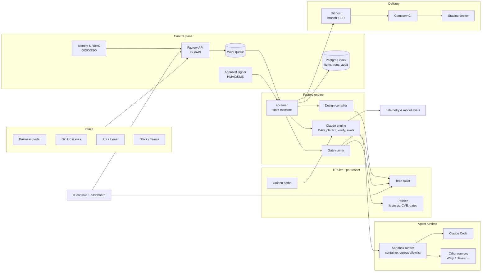
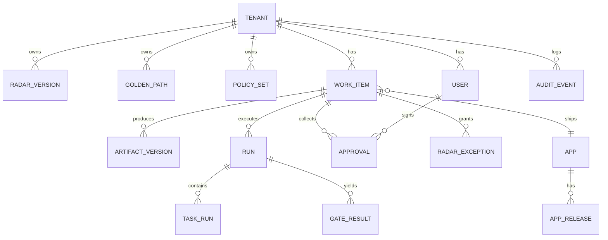
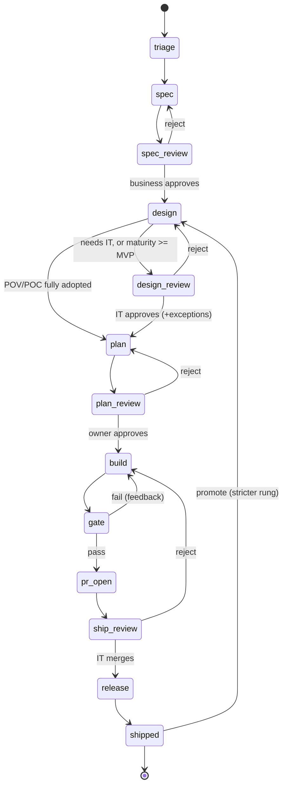

# AI Software Factory: development plan

*Version 1.0, 2026-10-07. Owner: Antoine. Companion docs: [PLANS.md](PLANS.md) (strategic options),
[PROGRESS.md](PROGRESS.md) (last verified state), [README.md](README.md) (how to run the MVP).*

This document plans the development of the whole product, from today's MVP (v0.1) to a multi-tenant,
production-grade software factory. It follows the recommended path from PLANS.md: **A (radar-as-code
in Claudo) → C (integrate into existing IT tooling) → B (own control plane)**.

---

## Contents

1. [Product vision](#1-product-vision)
2. [Where we are](#2-where-we-are-v01)
3. [Design principles](#3-design-principles-non-negotiable)
4. [Target architecture](#4-target-architecture)
5. [Phased roadmap](#5-phased-roadmap)
6. [Cross-cutting tracks](#6-cross-cutting-tracks)
7. [Timeline and staffing](#7-timeline-and-staffing)
8. [Risk register](#8-risk-register)
9. [Decisions needed from Antoine](#9-decisions-needed-from-antoine)
10. [Next 10 tasks](#10-next-10-tasks)

---

## 1. Product vision

**One sentence:** a software factory that turns business ideas into production-grade applications,
shipped by AI agents, **inside the rules the company's IT department already owns** (tech radar,
golden paths, security policies, merge rights).

### 1.1 Who it serves

| Persona | Pain today | What the factory gives them |
|---|---|---|
| **Business sponsor** (product owner, ops manager) | Ideas wait months for IT capacity; shadow IT POCs never reach production | Submit an idea in plain words, validate a spec, get a working app; follow value, not tickets |
| **IT department** (architects, platform team, CISO) | AI-generated code ignores standards; POCs built on forbidden stacks; nobody can audit what agents did | The radar and golden paths become enforced code; every technology choice is justified and checked; merge stays human |
| **Owner / delivery lead** | Agent output is unpredictable and costly | Plans approved before execution, gates per maturity, cost and first-pass metrics per run |
| **ESN / integrator** (Antoine's business) | Each client has different rules; delivery does not scale | One factory, one radar and golden-path set per client; repeatable governed delivery |

### 1.2 What makes it different

| Capability | Warp Factories | Factory.ai | softwarefactory.ai | **This factory** |
|---|---|---|---|---|
| Ticket/idea → PR with agents | yes | yes | claims | yes |
| Human checkpoints, factory never merges | yes | partial | n/a | yes, signed |
| **Stack compiled from the company tech radar** | no | no | claims "stack selection" | **yes, deterministic** |
| **Maturity ladder POV → POC → MVP → prod with stricter gates** | no | no | no | **yes** |
| Golden paths from IT as the build base | no | no | no | **yes** |
| Model-behaviour evals per role (who may implement) | no | no | no | **yes (Claudo)** |
| Self-hostable, vendor-neutral runners | Enterprise only | preview | unknown | **yes, by design** |

### 1.3 Success metrics (product KPIs)

| KPI | Definition | Target at v1.0 |
|---|---|---|
| Idea-to-POC lead time | intake → POC shipped | < 2 working days |
| POC-to-prod lead time | POC shipped → prod shipped | < 4 weeks |
| Radar compliance | shipped apps with zero un-approved radar violations | 100% (hard gate) |
| First-pass gate rate | builds passing all gates on first attempt | ≥ 60% |
| Human time per item | minutes spent at checkpoints | < 60 min for a POC |
| Cost per item | model spend per shipped POC | < $10 median |
| Escaped defects | prod incidents traced to factory-built code in first 30 days | tracked, trend down |

---

## 2. Where we are (v0.1)

Built and verified on 2026-10-07 (`just check`: 39 tests green; offline end-to-end demo passed; Claude
runner smoke test passed).

### 2.1 What exists

| Area | Module | Status |
|---|---|---|
| Tech radar as code, ring × maturity policy | `src/factory/radar.py`, `radar.toml` | done |
| Technology detection (manifests, images, imports) | `src/factory/detect.py` | done |
| Radar guard, usable on any repo | `src/factory/guard.py`, `factory check` | done |
| Gates: radar, secrets, tests, lint | `src/factory/gates.py` | done |
| Radar → design compiler | `src/factory/design.py` | done |
| Work items + state machine + checkpoints | `src/factory/workitem.py`, `foreman.py` | done |
| Agent runners: offline, Claude Code CLI | `src/factory/agents.py` | done (Claude path smoke-tested only) |
| Golden path python-fastapi | `golden_paths/python-fastapi/` | done |
| CLI | `src/factory/cli.py` | done |

### 2.2 What Claudo (AI-Workflow-gates) already brings

| Claudo module | Capability | Used by the factory today? |
|---|---|---|
| `orchestrate.py` | DAG execution of tasks.md, parallel tasks, eval gate per task, max 3 iterations | no: factory builds in one agent call |
| `planlint.py`, `plan.py` | static validation of tasks.md (acyclic, spec IDs exist, disjoint parallel paths) | no |
| `verify.py` | verify commands parsed to argv, run without a shell, allowlisted | no |
| `approvals.py` | HMAC-signed checkpoint tokens, replay prevention | no: factory roles are self-declared |
| `sandbox_runner.py` + `deploy/sandbox/` | hardened container runner: repo-only mount, no secrets, egress allowlist | no |
| `trajectory_guard.py` | checks HOW a run happened (journal + git) | no |
| `run_report.py`, `journal_io.py` | telemetry: first-pass rate, cost per role/model, failure clusters | no |
| `eval_models.py`, `registry.toml` | model × role evaluation (behavioural, chain-of-command, scorecard) | no |
| `content_guard.py` | spec/design substance cannot change without a version bump | no |
| `brand_guard.py` | denylist guard (pattern reused for radar guard) | pattern only |

**Main gap:** the factory and Claudo are two codebases. The plan's first engineering move (phase 1)
is to make Claudo the factory's build engine instead of duplicating it.

### 2.3 Known limits of v0.1

- Roles are self-declared (`--as it`): no identity, no signature.
- The build is a single agent call, with no task DAG, per-task verification or per-task evals.
- Offline mode cannot fix a failed gate.
- Only one golden path; React is chosen in designs, but there is nothing to scaffold it.
- Capability detection is keyword-based.
- No delivery to a real git remote: apps are folders, not repositories or pull requests.
- Claudo does not run natively on Windows (`fcntl`).

---

## 3. Design principles (non-negotiable)

These are the product's ADRs. Any feature that breaks one needs an explicit amendment here.

| # | Principle | Consequence in code |
|---|---|---|
| P1 | **The stack is compiled, never generated.** Technologies come from the radar, chosen deterministically. | Design compiler stays deterministic; agents only add prose; radar guard runs on every artifact and build. |
| P2 | **The factory never merges.** The final checkpoint is always a human from IT. | No code path can set `shipped` without a signed IT approval. |
| P3 | **IT owns the rules, the factory owns the shipping.** | Radar, golden paths and policies are IT-edited data (PR-reviewed); policy logic is versioned code. |
| P4 | **Stricter as it matures.** Each maturity rung adds gates; promotion is a checkpoint. | Gate sets and ring policy are keyed by maturity. |
| P5 | **The repo is the memory.** Artifacts, decisions and runs are files in git, readable without the product. | Triplet + item state + journal live in the app repo; the DB is an index, not the source of truth. |
| P6 | **Deterministic gates, explainable failures.** Every block says what, where and what to do instead. | Gates return structured results; no LLM-as-judge in a blocking gate. |
| P7 | **Vendor-neutral agents.** Any coding agent can be a runner; models change on measured proof. | `AgentRunner` interface; model ↔ role assignment from Claudo's eval harness. |
| P8 | **Least privilege for agents.** Agents never hold approval secrets, merge rights or open egress. | Sandbox runner by default from phase 1; secrets only in the control plane. |
| P9 | **Tenant isolation by construction.** One client's radar, code, prompts and telemetry never reach another. | Tenant ID on every record, per-tenant storage and runners, per-tenant model keys. |
| P10 | **Offline first.** Everything except the agents runs offline, free and fast; tests never hit paid APIs. | Fake runners and executors in tests; billed runs are opt-in campaigns. |

---

## 4. Target architecture

### 4.1 Component view (v1.0)

### 4.2 Components

| Component | Responsibility | Built from |
|---|---|---|
| **Intake connectors** | Turn an idea from any channel into a work item; post status back | new (phase 2, 5) |
| **Factory API** | Single entry point for UI, connectors and CLI; RBAC; audit | new (phase 4) |
| **Work queue + workers** | Run foreman steps asynchronously, in parallel across items | new (phase 4) |
| **Foreman** | Item state machine, checkpoints, retries, promotion | `foreman.py` (v0.1) |
| **Radar service** | Load, validate and version radars; import from Backstage / BYOR; drift detection | `radar.py` + new importers (phase 3) |
| **Design compiler** | Radar → design.md; capability detection | `design.py` + LLM-assisted capability extraction, still deterministic for tech choice (phase 3) |
| **Claudo engine** | tasks.md DAG execution, planlint, verify policy, per-task evals, journal | Claudo `lab/engine` (phase 1) |
| **Gate runner** | Maturity-based gates, structured results | `gates.py` + security gates (phase 6) |
| **Agent runtime** | Runner interface, sandbox, model registry | `agents.py` + Claudo `runner.py` and `sandbox_runner.py` (phase 1) |
| **Delivery** | Repo creation from golden path, branch, PR, CI status, staging deploy | new (phase 2, 6) |
| **Approval signer** | Signed, non-forgeable checkpoint decisions bound to a user identity | Claudo `approvals.py`, then KMS-backed (phase 1, 4) |
| **Telemetry & evals** | Cost, first-pass rate, failure clusters; model ↔ role arbitration | Claudo `run_report.py`, `eval_models.py` (phase 8) |
| **IT console / business portal / dashboard** | Human surfaces | new (phase 4) |

### 4.3 Data model (target)

| Entity | Key fields | Source of truth |
|---|---|---|
| Tenant | id, name, region, model keys (ref), budget | DB |
| RadarVersion | tenant, version, content hash, author, approved_by | git (radar repo), DB index |
| GoldenPath | tenant, id, repo URL / folder, tech ids, version | git |
| PolicySet | tenant, gates per maturity, license allowlist, CVE threshold | git |
| WorkItem | tenant, slug, kind (new app / feature / bug / migration), maturity, stage, status | git (item.json in app repo), DB index |
| ArtifactVersion | item, name (spec/design/tasks), version, hash, author (human/agent) | git |
| Run / TaskRun | item, stage, runner, model, tokens, cost, duration, outcome | journal.jsonl, DB index |
| GateResult | run, gate, ok, structured detail | gate-report, DB |
| Approval | item, stage, user, role, decision, reason, signature, timestamp | signed token in repo + DB |
| RadarException | item, tech, granted_by, expires_at, reason | DB + item.json |
| App / AppRelease | repo URL, maturity, version, environment, deployed_at | git host, DB |
| AuditEvent | tenant, actor, action, object, before/after hash | append-only DB table + export |

### 4.4 Work item lifecycle (target)

New stages vs v0.1: `pr_open` (phase 2), `release` (phase 6). New item kinds: `feature` and `bug` on an
existing app (phase 2), and `migration` opened automatically by radar drift (phase 3).

---

## 5. Phased roadmap

Each phase has **exit criteria that are commands or observable facts**. A phase is done only when its exit
criteria pass in a session and are quoted in PROGRESS.md. Estimates assume **1 engineer working with coding
agents**. They are rough: re-estimate at the end of each phase.

Work item IDs: `P<phase>-<n>`.

### Phase 0: stabilise the MVP (1 week)

**Goal:** v0.1 is reliable for demos and real `--runner claude` items.

| ID | Work | Detail |
|---|---|---|
| P0-1 | Live run report | Run 3 real items with `--runner claude` (POC); record cost, duration, failures in PROGRESS.md |
| P0-2 | Fix friction from tonight's test | Whatever P0-1 reveals (prompts, timeouts, error messages) |
| P0-3 | Build retries with agent | On a failed gate, the Claude runner gets the gate report; add max 3 automatic attempts, then block |
| P0-4 | `factory demo` command | Scripted offline walkthrough for sales demos |
| P0-5 | First commit + license | Initial commit (personal identity), add a license (decision D1) |
| P0-6 | CI for the factory itself | GitHub Actions running `just check` |

**Exit criteria:** `just check` green in CI; 3 live POC items shipped with total cost and first-pass rate
recorded; demo runs in under 2 minutes.

### Phase 1: Claudo becomes the build engine (3-4 weeks)

**Goal:** one engine. The factory handles intake, radar, design and checkpoints. Claudo executes the
plan task by task, with planlint, verify, per-task evals and signed approvals.

| ID | Work | Detail |
|---|---|---|
| P1-1 | Port Claudo to Windows | Replace `fcntl.flock` with a cross-platform lock (`msvcrt.locking` on Windows, or a lock-file with PID + stale check); `just gate-ci` green on Windows and Linux |
| P1-2 | Package the engine | Extract `lab/engine` into an installable package `claudo-engine` (uv workspace or git dependency, decision D2); keep Claudo's own tests passing |
| P1-3 | Planner output passes planlint | The plan stage must produce a tasks.md that `planlint.validate` accepts; on lint failure, re-prompt with the errors (max 2), then block |
| P1-4 | Build = Claudo orchestration | Replace the single build call with `orchestrate` on `apps/<slug>/work/<slug>/` via `run-project`; parallel groups, `verify` per task, eval gate per task |
| P1-5 | Radar guard inside planlint | A task whose `files_touched` or prompt introduces a forbidden technology fails planlint before any execution |
| P1-6 | Signed approvals | Factory checkpoints use `approvals.py` (HMAC); the secret lives outside the agent's reach; `approve` writes a signed token, `run` verifies it |
| P1-7 | Sandbox by default for builds | Use `sandbox_runner.py` (Docker) when Docker is available; host runner only with an explicit `--unsafe-host` flag |
| P1-8 | Journal + trajectory guard | Every factory run writes `.runs/journal.jsonl`; `trajectory_guard` becomes a gate from MVP up |
| P1-9 | Content guard on spec/design | Spec or design substance cannot change after approval without a version bump and a new review |
| P1-10 | Migrate runner interface | One `AgentRunner` interface shared by factory and Claudo |

**Exit criteria:** a live POC item is built through Claudo's DAG with ≥ 3 tasks, per-task verify, and
signed approvals verified; an agent-written fake approval token is rejected (test); Claudo `just gate-ci`
green on Windows; factory `just check` green.

### Phase 2: real delivery: git, pull requests, GitHub intake (3 weeks)

**Goal:** apps are real repositories; the factory opens pull requests and never merges.

| ID | Work | Detail |
|---|---|---|
| P2-1 | Repo creation from golden path | New app = new repo (GitHub, via `gh` / API) created from the golden path template; branch protection checked |
| P2-2 | Branch + PR per build | Build happens on `factory/<slug>/<attempt>`; PR body = spec summary, design stack, gate report, cost, links to triplet |
| P2-3 | `pr_open` stage | Item waits on the PR; IT approves by merging (webhook) or via `factory approve`; merge detected = shipped |
| P2-4 | CI status as a gate | The company CI result on the PR is read back as a gate (in addition to local gates) |
| P2-5 | GitHub issue intake | Issue template "Business idea"; label `factory` triggers intake; factory comments status and checkpoint links |
| P2-6 | Feature / bug on an existing app | Item kind `feature`/`bug` targets an existing repo: design is the existing design + delta; radar check on the diff |
| P2-7 | Commit format | Commits follow Claudo's canonical format (`Why:` body, trailers `Spec-IDs`, `Checkpoint`, `Run`) |
| P2-8 | Git-host abstraction | Interface with GitHub first; GitLab and Azure DevOps stubs |

**Exit criteria:** from a labelled GitHub issue to a merged PR on a new repo, with the factory commenting
each checkpoint; the factory token has no merge permission (verified by test against branch protection);
a feature item on an existing repo produces a PR whose diff passes the radar gate.

### Phase 3: Radar 2.0: import, policies, drift (3 weeks)

**Goal:** the factory adapts to the company's real radar and keeps apps compliant over time.

| ID | Work | Detail |
|---|---|---|
| P3-1 | Radar importers | Import from Thoughtworks BYOR (CSV/JSON), Backstage tech-radar plugin format, and a spreadsheet template; map quadrants to capabilities |
| P3-2 | Radar validation & diff | `factory radar diff old new`: what moved ring, which apps are affected |
| P3-3 | Version constraints | Radar entries can pin versions (`python >= 3.12`, `fastapi >= 0.115`); guard checks lockfiles |
| P3-4 | License policy | Allowed / forbidden licenses (e.g. no AGPL in prod); dependency licenses from lockfile metadata |
| P3-5 | Vulnerability policy | OSV database lookup of locked dependencies; threshold per maturity (none ≥ high in prod) |
| P3-6 | Drift detection | Scheduled scan of shipped apps against the current radar; a tech moved to hold → auto-opened `migration` item with suggested replacement |
| P3-7 | Exceptions with expiry | IT exceptions get an owner, a reason and an expiry date; expired exceptions fail the gate |
| P3-8 | More golden paths | `react-vite` frontend, `python-worker` (queue consumer), `fullstack` (FastAPI + React); golden path manifest declaring which radar techs it covers |
| P3-9 | Smarter capability extraction | LLM extracts capabilities from the idea as structured output, validated against the radar's categories; technology choice stays deterministic (P1) |
| P3-10 | Radar-aware spec hints | Triage flags early when an idea needs a capability the radar cannot fill (gap → IT question before spec) |

**Exit criteria:** a real-world radar (BYOR CSV with ≥ 50 entries) imports and validates; moving a tech to
`hold` opens migration items for every affected app (test); a dependency with a known critical CVE blocks a
prod gate; a fullstack idea is scaffolded from two golden paths and passes gates.

### Phase 4: control plane: API, UI, identity (6-8 weeks)

**Goal:** non-developers use the factory: business in a portal, IT in a console, everyone authenticated.

| ID | Work | Detail |
|---|---|---|
| P4-1 | Factory API | FastAPI service exposing items, checkpoints, radar, apps, runs; OpenAPI contract; the CLI becomes an API client |
| P4-2 | Persistence | Postgres index (items, runs, approvals, audit); git remains source of truth for artifacts (P5) |
| P4-3 | Work queue + workers | Async execution of foreman steps; per-tenant concurrency limits; idempotent steps; retry policy |
| P4-4 | Identity | OIDC / SSO (Entra ID, Google, Okta); roles business / IT / owner / admin mapped from IdP groups |
| P4-5 | Approvals bound to identity | Signed approval = user identity + item + stage + artifact hashes; signer key in KMS / Vault |
| P4-6 | Business portal | Submit idea (guided form), read and comment the spec, approve/reject, see status and delivered app link |
| P4-7 | IT console | Radar editor (PR-backed), golden paths, policies, exception queue, design reviews, drift view |
| P4-8 | Dashboard | Per item: stage, gates, cost; per tenant: lead times, first-pass rate, compliance, spend |
| P4-9 | Notifications | Email + Slack/Teams for checkpoints waiting; digest for IT |
| P4-10 | Audit log | Append-only audit events; export (CSV/JSON) for compliance reviews |

**Exit criteria:** a business user with no CLI submits an idea in the portal and approves the spec; an IT user
approves the design and merges; every decision appears in the audit log with the signed identity; an
unauthenticated or wrong-role request is refused (tests); end-to-end UI test passes in CI.

### Phase 5: ecosystem integrations (4 weeks, can overlap phase 4)

**Goal:** meet companies where they already work (Plan C).

| ID | Work | Detail |
|---|---|---|
| P5-1 | Jira and Linear intake | Issue type / label triggers intake; status sync both ways |
| P5-2 | Slack / Teams app | `/factory idea ...`, checkpoint buttons (approve/reject open the portal with SSO) |
| P5-3 | Backstage plugin | Radar read from Backstage; shipped apps registered in the catalog; golden paths = Backstage software templates |
| P5-4 | External runners | Runner adapters for other coding agents (Warp, Factory.ai, Devin, OpenAI Codex) behind `AgentRunner`, gated by the same checks; verify their extension points first (risk R5) |
| P5-5 | Webhooks out | Events (item.created, checkpoint.waiting, app.shipped) for company automation |
| P5-6 | Claudo export/import | Two-way: a Claudo project feature can be imported as a factory item |

**Exit criteria:** an idea created in Jira ships as a PR with status synced back; the radar shown in
Backstage and the one enforced by the factory are the same version (test); one external runner builds
a POC that passes the same gates.

### Phase 6: production-grade ladder (4-5 weeks)

**Goal:** "prod" means production-grade by the company's definition, not just tests passing.

| ID | Work | Detail |
|---|---|---|
| P6-1 | SAST gate | Semgrep / Bandit rulesets per language; severity threshold per maturity |
| P6-2 | SCA + SBOM | Dependency audit (OSV / pip-audit / npm audit); CycloneDX SBOM attached to each release |
| P6-3 | Container scan | Trivy (or company scanner) on the built image |
| P6-4 | IaC golden path | Deployment templates (Helm / Terraform / Cloud Run) from IT; IaC scanned (Checkov) |
| P6-5 | Staging deploy + smoke | `release` stage deploys to staging, runs smoke tests from spec EVALs |
| P6-6 | Observability baseline | Golden path includes structured logs, health, metrics, tracing hooks; gate checks they exist |
| P6-7 | Performance smoke | Spec-defined latency/throughput targets checked in staging for MVP+ |
| P6-8 | Prod readiness checklist | Runbook, owner, on-call, data classification, backups: checklist artifact required for `prod`, validated by IT |
| P6-9 | Monitor → work items | Incidents/alerts on factory apps open `bug` items linked to the spec IDs |
| P6-10 | Gate plugins | Company-specific gates as plugins (command or Python entry point) declared in policy |

**Exit criteria:** promoting an MVP to prod runs SAST, SCA, container scan, IaC scan, staging deploy, smoke
and perf checks, and requires the readiness checklist; an app with a seeded high CVE or a missing health
endpoint is blocked (tests); an SBOM is attached to the release.

### Phase 7: enterprise and multi-tenancy (6 weeks)

**Goal:** sell to companies and run several clients safely (Plan B).

| ID | Work | Detail |
|---|---|---|
| P7-1 | Tenant isolation | Tenant ID enforced in API, DB (row-level security), storage, queues, runners; isolation tests |
| P7-2 | Per-tenant model config | Model keys, allowed models, data-processing region per tenant (e.g. EU-only endpoints) |
| P7-3 | Budgets and cost controls | Per-tenant and per-item spend caps; stop and ask when exceeded |
| P7-4 | Self-hosted / on-prem | Helm chart + docker-compose; air-gapped mode with self-hosted runners and model endpoints |
| P7-5 | Secrets management | Vault / cloud KMS integration; no secret in DB or repo |
| P7-6 | Compliance pack | GDPR (DPA, data map, retention), EU AI Act transparency notes, security whitepaper, threat model doc |
| P7-7 | Backup / DR | DB backups, restore drill, RPO/RTO stated |
| P7-8 | Admin console | Tenants, users, usage, billing exports |
| P7-9 | Pen test | External penetration test before first paying client in production |

**Exit criteria:** two tenants run concurrently with zero cross-tenant reads (automated tests + pen test);
on-prem install from the Helm chart completes on a clean cluster; budget cap halts a run as designed.

### Phase 8: continuous improvement loop (ongoing, starts in phase 1)

**Goal:** the factory measurably improves over time.

| ID | Work | Detail |
|---|---|---|
| P8-1 | Telemetry pipeline | Journal → DB → dashboard: first-pass rate, attempts, cost per role/model, failure clusters (`run_report.py`) |
| P8-2 | Golden evals per tenant | Each tenant gets golden features (spec + hidden evals) to benchmark models on their stack |
| P8-3 | Model arbitration | `eval_models.py` campaigns on new models; role assignment changes only on measured proof (Claudo EVOLUTION loop) |
| P8-4 | Prompt/scaffold evolution | Agent `.md` changes go through evals → patch → verify → version bump |
| P8-5 | Feedback mining | Rejection reasons and gate failures clustered into improvements (templates, golden paths, radar gaps) |

**Exit criteria (recurring):** monthly report with KPI trends (section 1.3); no model/prompt change shipped
without an eval campaign showing no regression.

---

## 6. Cross-cutting tracks

### 6.1 Security model

| Threat | Mitigation | Phase |
|---|---|---|
| Agent forges a checkpoint approval | HMAC-signed tokens; secret never in agent env; sandbox | 1 |
| Agent introduces a forbidden or malicious dependency | radar guard (manifest, import, image), lockfile check, SCA, license gate | 0, 3, 6 |
| Hallucinated / typosquatted package | lockfile resolution must succeed; unknown packages need IT approval; registry allowlist via proxy | 1, 3 |
| Secret leakage into code | secrets gate; env-only config in golden paths | 0 |
| Prompt injection via issue text or repo content | intake text is data, never instructions to tools; agents run sandboxed with egress allowlist; no secrets reachable | 1, 2 |
| Data exfiltration by an agent | egress allowlist (model API + package registry only) | 1 |
| Factory credentials abused to merge | factory token without merge rights; branch protection verified | 2 |
| Cross-tenant leakage | tenant isolation by construction + tests + pen test | 7 |
| Insider bypass of gates | signed approvals bound to identity, audit log, gates re-run in company CI | 4 |

A written threat model (STRIDE) is a deliverable of phase 1, updated in phases 4 and 7.

### 6.2 Testing strategy

| Layer | What | When it runs | Cost |
|---|---|---|---|
| Unit | pure modules (radar, detect, guard, design, planlint) | every commit (`just check`) | free |
| Flow | foreman end-to-end with fake runner and fake executor | every commit | free |
| Golden evals | fixed ideas → full pipeline with offline runner; outputs compared | every commit | free |
| Security tests | forged approval, hold dependency, secret in code, wrong role, cross-tenant read | every commit | free |
| Integration | real `uv`, real git, local Docker sandbox | nightly / pre-release | free |
| Contract | connector payloads (GitHub, Jira, Slack) against recorded fixtures | every commit | free |
| Live campaigns | real models on golden features (`eval_models.py`) | opt-in, before model/prompt changes | billed: smoke first, confirm before full run |
| UI end-to-end | portal and console flows (Playwright) | pre-release | free |

Rule (P10): no test hits a paid API by default. Billed runs are explicit, with a smoke run first.

### 6.3 Tech stack of the factory itself

Kept inside the default radar, so the factory "eats its own dog food":
Python 3.12+, uv, FastAPI, Pydantic v2, SQLAlchemy 2 + Postgres, pytest, ruff, React (portal/console),
Docker, GitHub Actions, Claude API / Claude Code as the default agent runtime.

### 6.4 Documentation (Diátaxis, as in Claudo)

| Type | Examples | Phase |
|---|---|---|
| Tutorials | "Ship your first POC", "Set up your company radar" | 0, 3 |
| How-to | import a radar, add a golden path, grant an exception, promote to prod, add a gate plugin | 1-6 |
| Reference | CLI, API (OpenAPI), radar schema, policy schema, factory.toml | 1-4 |
| Explanation | ring × maturity policy, why the stack is compiled, security model, multi-tenancy | 1-7 |

### 6.5 Release and versioning

- SemVer for the factory. v0.x until phase 4 is done; v1.0 = phases 0-6 complete and one pilot client in production.
- Radar, golden paths and policies are versioned independently by IT; each work item records the radar
  version it was built against.
- CHANGELOG per release; migration notes for schema changes (radar, factory.toml, item.json).

### 6.6 Go-to-market alignment (ESN)

| Milestone | Commercial use |
|---|---|
| After phase 0 | Live demo: idea → governed POC in minutes |
| After phase 2 | Pilot offer: "governed POC factory" on one client repo, delivered by the ESN |
| After phase 3 | Radar onboarding service: import and clean a client's tech radar, build its golden paths |
| After phase 6 | "POC to production" offer with a production-grade ladder |
| After phase 7 | Licensed / self-hosted product for larger clients |

---

## 7. Timeline and staffing

### 7.1 Indicative timeline (1 engineer + agents)

| Phase | Duration | Cumulative (weeks) | Milestone |
|---|---|---|---|
| 0 Stabilise MVP | 1 | 1 | v0.2, live POCs measured |
| 1 Claudo engine | 3-4 | 5 | v0.3, one engine, signed approvals, sandbox |
| 2 Real delivery | 3 | 8 | v0.4, issue → PR, factory never merges |
| 3 Radar 2.0 | 3 | 11 | v0.5, real radars, drift, licenses, CVE |
| 4 Control plane | 6-8 | 19 | v0.6, portal + console + SSO |
| 5 Integrations | 4 (overlaps 4) | 21 | v0.7, Jira/Slack/Backstage |
| 6 Prod ladder | 4-5 | 26 | v0.9, production-grade gates, staging |
| 7 Enterprise | 6 | 32 | v1.0 candidate, multi-tenant, on-prem |
| 8 Improvement | ongoing | - | monthly KPI report |

About **8 months solo**. With a team of 3 (backend, frontend, platform/security), phases 4-5 and 6-7 run in
parallel: about **4-5 months** to v1.0.

### 7.2 Suggested team when funded

| Role | Focus |
|---|---|
| Lead / FDE (Antoine) | product, radar onboarding, client pilots, engine |
| Backend engineer | API, queue, persistence, connectors |
| Frontend engineer | portal, console, dashboard |
| Platform / security engineer | sandbox, delivery, prod gates, multi-tenancy, compliance |

### 7.3 Running costs to plan for

| Item | Estimate | Note |
|---|---|---|
| Model spend in development | $100-300 / month | live campaigns are opt-in |
| Model spend per client POC | < $10 median target | measured from phase 0 |
| Hosting (pilot) | low: one VM or managed container + Postgres | self-hosted per client later |
| Pen test (phase 7) | external quote | before first production client |

All figures are planning assumptions to replace with measurements from phase 0.

---

## 8. Risk register

| ID | Risk | Likelihood | Impact | Mitigation |
|---|---|---|---|---|
| R1 | Big platforms (Anthropic, GitHub, Warp, Factory.ai) ship radar-style governance | medium | high | Move fast on radar + maturity ladder + ESN delivery; stay vendor-neutral so we can sit on top of them |
| R2 | Agent output quality too low for MVP/prod rungs | medium | high | Claudo DAG + per-task evals; golden evals; humans at checkpoints; measure first-pass rate from phase 0 |
| R3 | Model costs per item too high | medium | medium | Cost per role tracked; cheaper models where evals allow; budgets (phase 7) |
| R4 | Enterprises refuse cloud model processing of their code | medium | high | Self-hosted runners, EU endpoints, on-prem (phase 7); design for it from phase 1 (P9) |
| R5 | External runner APIs (Warp, Factory.ai) not open or unstable | high | low | Claude Code as default; adapters only after extension points are verified |
| R6 | Radar data in companies is messy or absent | high | medium | Radar importers + onboarding service; sensible default radar to start from |
| R7 | Security incident via agent (exfiltration, malicious dep) | low | very high | Sandbox, egress allowlist, gates, no secrets reachable, pen test |
| R8 | Solo-developer bandwidth | high | high | Strict phase scope; reuse Claudo; ESN pilots fund the team |
| R9 | Two codebases (factory, Claudo) drift apart | medium | medium | Phase 1 converges them first |
| R10 | Legal: no license, unclear IP of generated code | medium | medium | Pick license (D1); client contract states IP of generated code |

---

## 9. Decisions needed from Antoine

| ID | Decision | Options | Recommendation |
|---|---|---|---|
| D1 | License | Apache-2.0 / MIT / BSL / proprietary | Apache-2.0 for the engine (personal-brand, open source), commercial license for the control plane later |
| D2 | Claudo packaging | uv workspace monorepo / git dependency / vendor copy | monorepo with uv workspace: one CI, atomic changes |
| D3 | First git host | GitHub / GitLab / Azure DevOps | GitHub first (your repos and `gh` are there) |
| D4 | First intake after GitHub issues | Jira / Linear / Slack / portal | portal (phase 4) for business users; Jira first among connectors for enterprise clients |
| D5 | Default sandbox | Docker required / optional | required for MVP+ builds, optional for POV/POC on a dev machine |
| D6 | Product name | "AI-factory" / "Claudo Factory" / other | decide before phase 2 (repo names, PR bodies, docs) |
| D7 | First pilot client profile | ESN client / internal SFEIR-like context / friendly startup | a friendly mid-size company with an existing radar; keep work and personal repos separate |

---

## 10. Next 10 tasks

In order, each verifiable:

1. **P0-1** Run tonight's live test (README section 2); record cost, duration, failures in PROGRESS.md.
2. **P0-5** Decide D1, add the license, make the first commit.
3. **P0-6** Add GitHub Actions running `just check`.
4. **P0-3** Automatic build retries (max 3) with the gate report as feedback; test with a fake runner.
5. **P0-4** `factory demo` command; check it runs in < 2 minutes.
6. **P1-1** Port Claudo's `fcntl` lock to a cross-platform lock; `just gate-ci` green on Windows.
7. **P1-2** Decide D2; set up the uv workspace with `claudo-engine` + `factory`.
8. **P1-3** Plan stage output validated by `planlint`, re-prompt on errors.
9. **P1-6** Signed approvals via `approvals.py`; test that an agent-written token is rejected.
10. **P1-4** Build through Claudo's orchestrator on one live POC item; compare cost and first-pass rate with P0-1.
